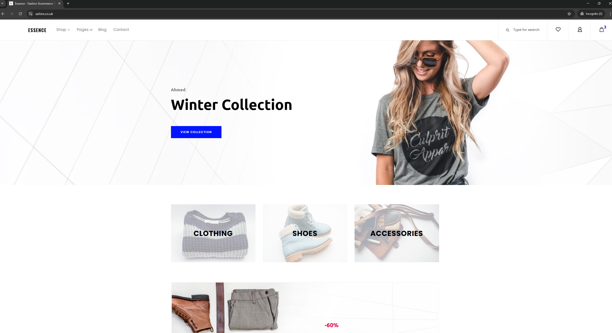
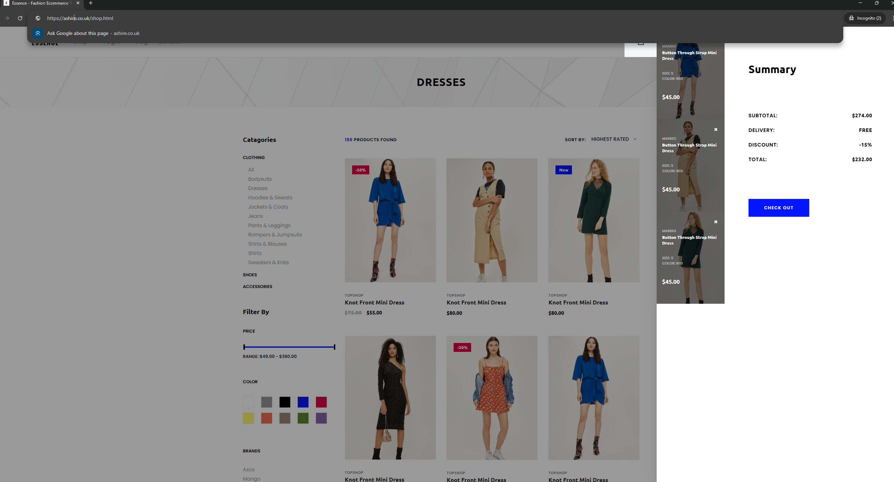
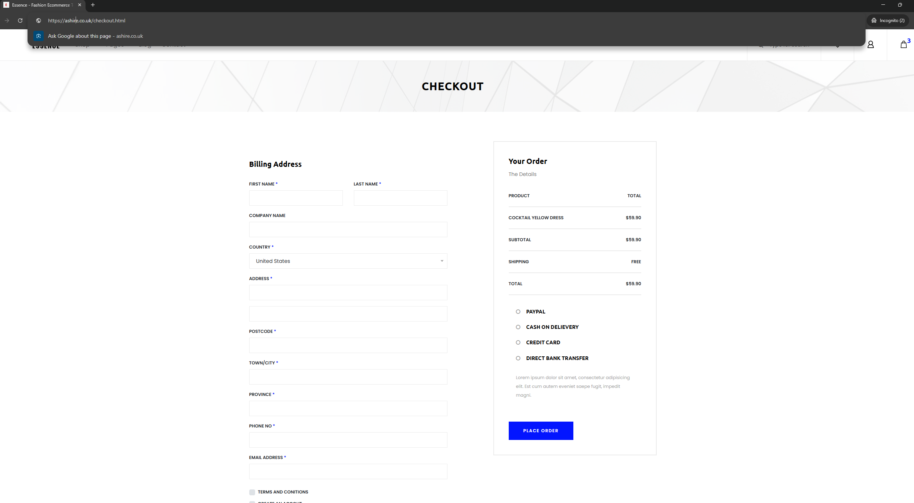

# App: Winter Collection Ecommerce

The Winter Collection Ecommerce App offers a simple and stylish way to shop cozy winter essentials. Browse coats, sweaters, and accessories with ease, enjoy secure checkout, and find everything you need to stay warm and fashionable this season.

# Table of Contents

- [App: Winter Collection Ecommerce](#app-winter-collection-ecommerce)
- [Table of Contents](#table-of-contents)
- [Terraform Structure](#terraform-structure)
- [Modules](#modules)
- [Backend](#backend)
- [Deployment Workflow](#deployment-workflow)
- [ECR Winter Collection Image Build & Push](#ecr-winter-collection-image-build--push)
- [AWS Services Used](#aws-services-used)
- [Architecture Diagram](#architecture-diagram)

# Terraform Structure

.
├── terraform/
│   ├── main.tf
│   ├── provider.tf
│   ├── output.tf
│   ├── variable.tf
│   └── modules/
│       ├── network/
│       │   ├── main.tf
│       │   ├── variable.tf
│       │   └── output.tf
│       ├── compute/
│       │   ├── main.tf
│       │   ├── variable.tf
│       │   └── output.tf
│       ├── ecr/
│       │   ├── main.tf
│       │   ├── variable.tf
│       │   └── output.tf
│       ├── iam/
│       │   ├── main.tf
│       │   └── output.tf
│       ├── alb/
│       │   ├── main.tf
│       │   ├── variable.tf
│       │   └── output.tf
│       ├── ecs/
│       │   ├── main.tf
│       │   ├── variable.tf
│       │   └── output.tf
│       ├── route53/
│       │   ├── main.tf
│       │   ├── variable.tf
│       │   └── output.tf
│       └── acm/
│           ├── main.tf
│           ├── variable.tf
│           └── output.tf

# Modules

- **Network:** Sets up the virtual private network, including subnets, route tables, internet gateways, and security groups.
- **Compute:** Provisions compute resources.
- **ECR:** Builds the image, runs the container, and manages Amazon Elastic Container Registry (ECR) repositories for storing container images.
- **IAM:** Creates IAM roles and policies to manage access permissions.
- **ALB:** Manages Application Load Balancers for distributing incoming traffic.
- **ECS:** Deploys and manages Elastic Container Service clusters and tasks.
- **Route53:** Configures DNS records using Route 53.
- **ACM:** Provisions and manages AWS Certificate Manager certificates for SSL/TLS.

# Backend

In `provider.tf`: Configures the Terraform backend for storing state remotely (in S3). This is essential for team collaboration and state management. Also includes state locking using DynamoDB.

# Deployment Workflow

The deployment process is automated using GitHub Actions to ensure consistency. It includes ECR image management and Terraform infrastructure management, with secure credential handling via HashiCorp Vault.

# ECR Winter Collection Image Build & Push

- **Image Build and Scan:** Triggered manually after pushing to main; builds a Docker image, scans it for vulnerabilities using Trivy, then pushes to ECR.
- **Terraform Infrastructure Management:**
  - **Terraform Plan:** Triggered on push to main; performs linting and security scans using Checkov.
  - **Terraform Apply:** Applies Terraform changes; manually triggered by a push to main.
  - **Terraform Destroy:** Destroys Terraform infrastructure; requires manual confirmation.

# AWS Services Used

| Service               | Description                                                                                                  |
|-----------------------|--------------------------------------------------------------------------------------------------------------|
| VPC                   | Virtual Private Cloud for network isolation and security.                                                    |
| ALB                   | Application Load Balancer for routing traffic to ECS launch type services and reverse proxying.              |
| ECS                   | Elastic Container Service for running containers, creating task definitions, and services.                   |
| ECR                   | Elastic Container Registry for storing and managing Docker images.                                          |
| Security Groups (SG)   | Firewall rules for controlling inbound and outbound traffic.                                                |
| Route53                | DNS management for the custom domain.                                                                        |
| ACM                   | AWS Certificate Manager for SSL/TLS certificates.                                                           |
| IAM                   | Identity and Access Management for secure access control of resources used.                                  |
| Internet Gateway (IG) | Enables internet access to the VPC.                                                                          |
| NAT Gateway           | Enables instances in private subnets to connect to the internet or other AWS services without inbound access.|
| Public Subnet         | Subnet with a route to the Internet Gateway allowing direct access to the internet.                          |
| Private Subnet        | Subnet without a direct route to the internet, usually used for backend resources.                           |

# Architecture Diagram

